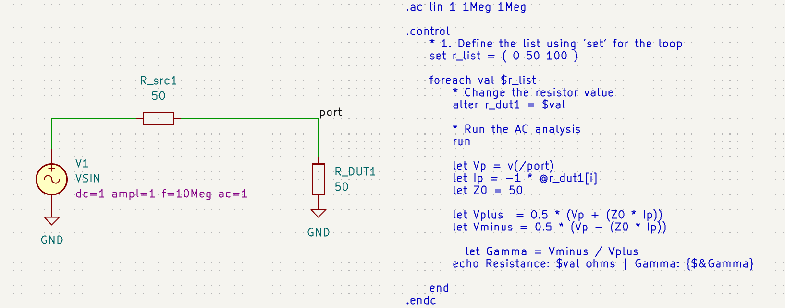
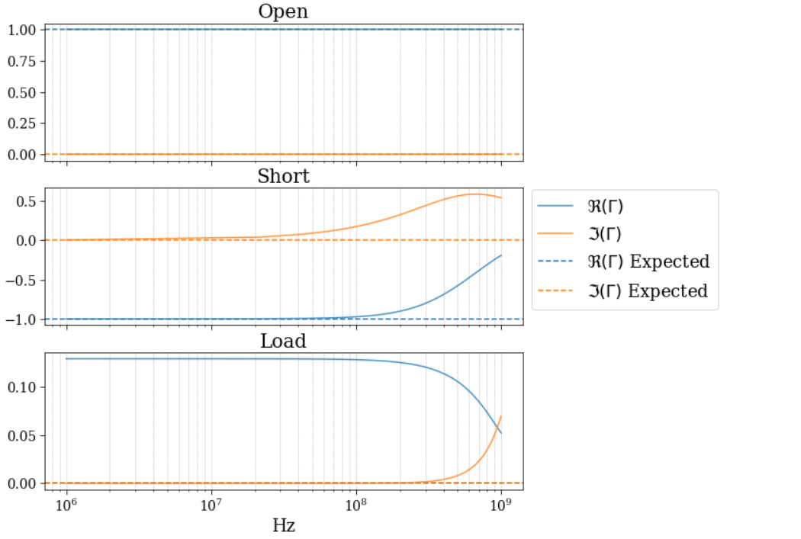
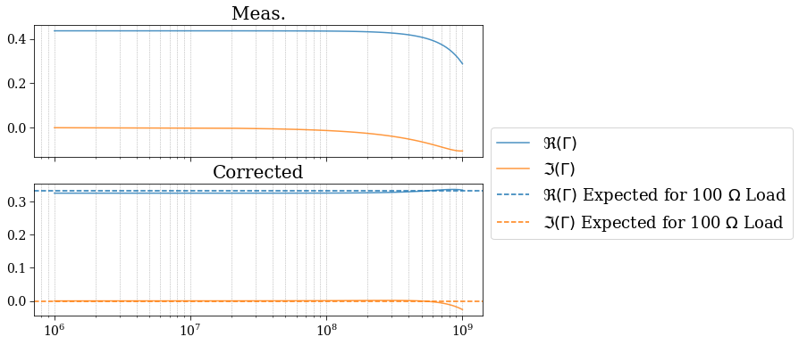
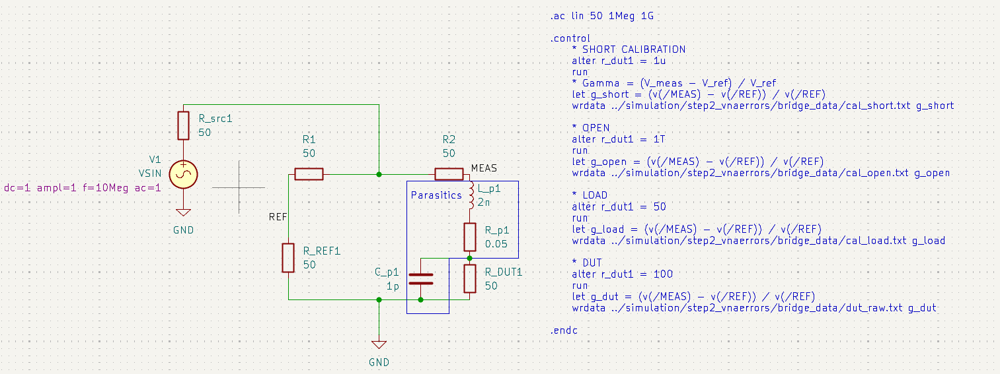
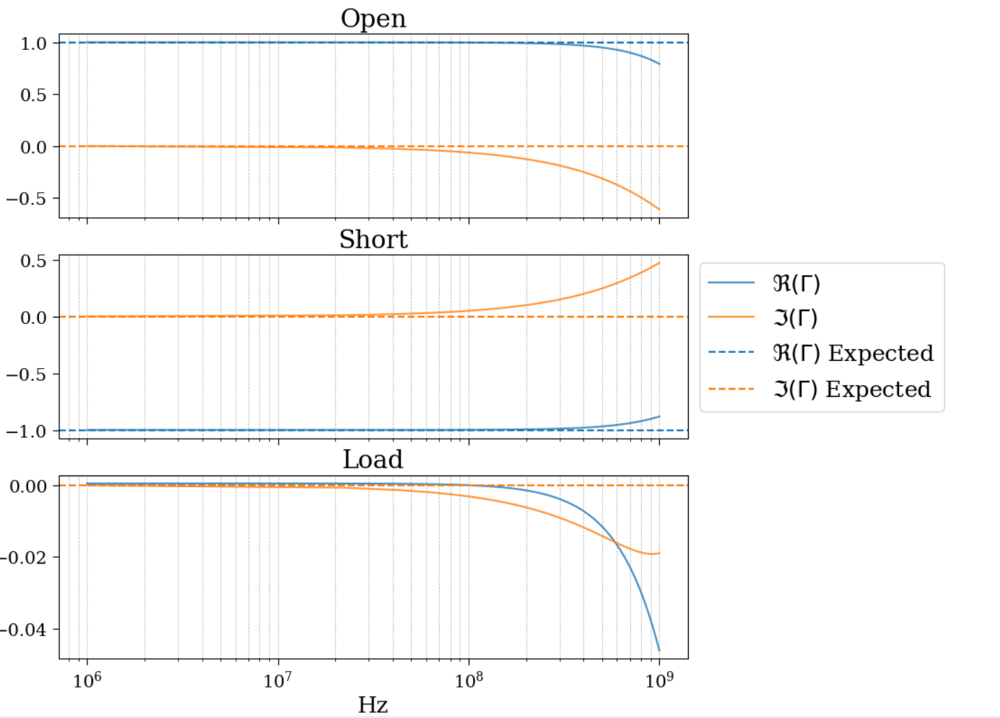
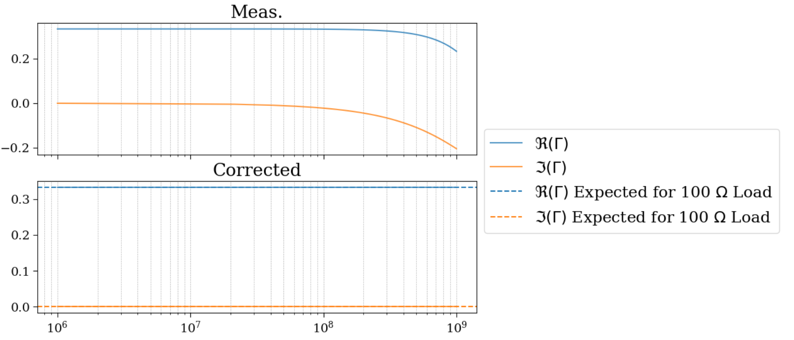

# **One Port VNA**

 My attempt at designing a one port VNA and to learn some RF fundamentals and technqiues. The goal here is to build a simple working S11 (reflection) VNA with minimal RF complexity.

## Architecture

The design will be based around the ADL 5960, a VNA frontend that should simplify many design considerations by black-boxing a few components of typical VNAs. Besides the ADL 5960, we will require an ADC stage, digital processing, and an RF source and a clock source.

## Repo Structure

- kicad/ Schematic and PCB design files

- docs/ Notes on design and theory, block diagrams, data sheets and user guides

- firmware/ ADC, FPGA code etc.

- simulations/ SPICE, RF simulations

- fabrication/ Fabrication outputs by kicad

- scripts/ Data processing and plotting

## Results

Results will be posted here as I progress. 

#### Step 1: Simulating Idealized Components

GOAL: Develop a system-level simulation using idealized components to return $\Gamma$ and $S_{11}$. It will consist of a voltage source (V_1), a source impedance ($R_{\text{src}}$) and a DUT ($R_{\text{load}}$).

 

The schematic and ngspice directive is shown above. 

A few notes on this...KiCAD has some quirks when running spice simulations (coming from xschem). Specifically, running plotting commands within .control does not work since KiCAD uses its own plotting software. This creates an issue since defining vectors and variables within the KiCAD simulator and plotter is very clunky. Here, I remedy this by running a single point in the .ac analysis and just printing $\Gamma$, since I don't expect any change at different frequencies. In the future, I'll have to use wrdata to export data and use python to plot. Also, .step does not work in KiCAD, so I had to use a foreach loop which edits the resistance of R_DUT, rather than setting a param and stepping through.

Results are below with some of the spice output cleaned up. They are as expected...

```
Resistance: 0 ohms | Gamma: -1
Resistance: 50 ohms | Gamma: 0
Resistance: 100 ohms | Gamma: 0.333333
```

#### Step 2: A more realistic simulation

GOAL: Introduce realistic imperfection into the model, such as parasitics and source matching errors and using a realistic coupler (ie a Return loss bridge) to model effects of error in measurement. 

##### 2a: VNA with Parasitics


In this model, we've simply introduced a set of parasitics: a series resistor and inductor and a shunt capacitor, with some arbitrary values. We run the simulation in 4 different scenarios: Open, Short, Load match (OSL) and a DUT ($R_{load}=100$  $\Omega$). The OSL measurement provides a calibration for the errors which are introduced via the parasitics. These are then calculated and used to correct for the DUT measurement.

The exact calculations and data processing are done in [this notebook](simulation/step2_vnaerrors/). The results of the OSL measurements are shown here:



Using these measurements in comparison to the expected values, we calculate out the error terms ($E_{dl}$, $E_{sf}$ and $E_{rf}$) and use them for the correct $\Gamma_{DUT}$ measurement:

$\Gamma= \frac{\Gamma_m -E_{dl}}{E_{rf} + E_{sf}(\Gamma_m - E_{dl})}$

The effects of this correction are shown below and compared to the expected value. 



##### 2b: VNA with Directional Coupling

Here, we will simulate the directional coupling found in the ALD5960 by implementing a bridge. I believe it is simplest to just use a wheatstone bridge in this case, since the ALD5960 does a lot of the handling of the RLB measurements. 

I've addded some parasitics in the system as well. 

Below shows the simulated ciruit:



The results of the OSL calibration and the corrected DUT are below:





These results show that we can take the VNA model, "break" it with non-ideal but realistic parts and then use a calibration + correction to fix it. 

##### 2c: Introducing a transmission line

In the previous step, the DUT and the REF measurements were taken at the same place. 

#### Step 3: Schematic Integration

GOAL: Integrate the ADL5960, ADC, RF source and clocking (could possibly be off-board), and supporting circuitry into a complete schematic.

[...]

#### Step 4: Layout

GOAL: Route and place the PCB. 
[...]

#### Step 5: Firmware

GOAL: Implement ADC capture, vector extraction and calibration routines. Generate results. 
