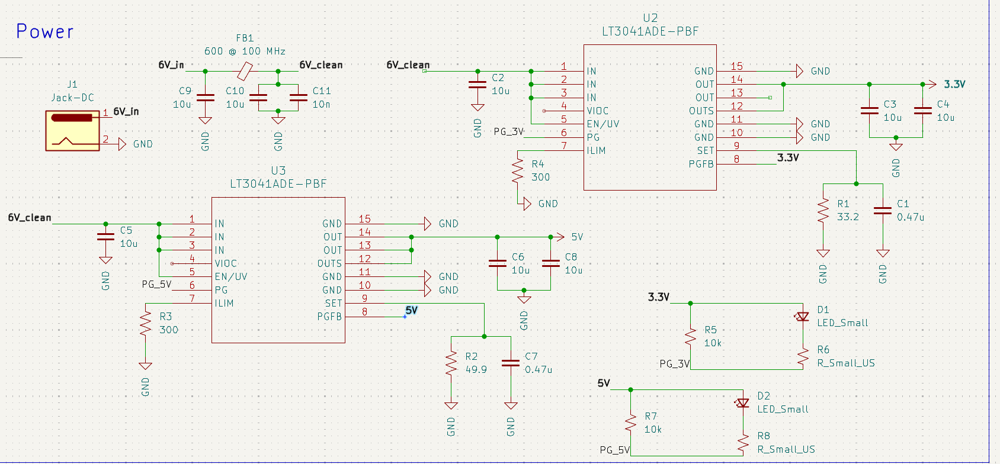

# Schematic Work

This README will be used to keep my notes and details as I work up the schematic in sections.

### Power

First Draft:

Designed around two LT3041 regulators to provide 5 V and 3.3 V levels. 

We will provide a 6 V input from a benchtop supply, connected to the board via DC barrel jack. 

A Pi-filter network consisting of a ferrite bead and capacitors filters out any high frequency noise. 

The output voltages of the LT3041 are set by a resistor to GND on the SET pin:

$R_{set}= V_{out}/100~\mu A$

and the output current limit is set by a resistor on the ILIM pin:

$R_{iout} = \frac{150~\text{mA} \times \text{k}\Omega}{I_{lim}}$

The caps are the input and output of the regulator are used for more noise filtering, and their placement in the layout will be important.

In addition, I've placed an LED indicator at the output of the regulator, using the PG and PGFB pins. I'm not entirely sure I've used the PGFB pins correctly honestly, since there aren't any good examples on the datasheet. And, I haven't decided the exact LEDs to use yet either, but I've gotten a start here. Perhaps, I can just use the voltage rails directly anyway, instead of PG. 
